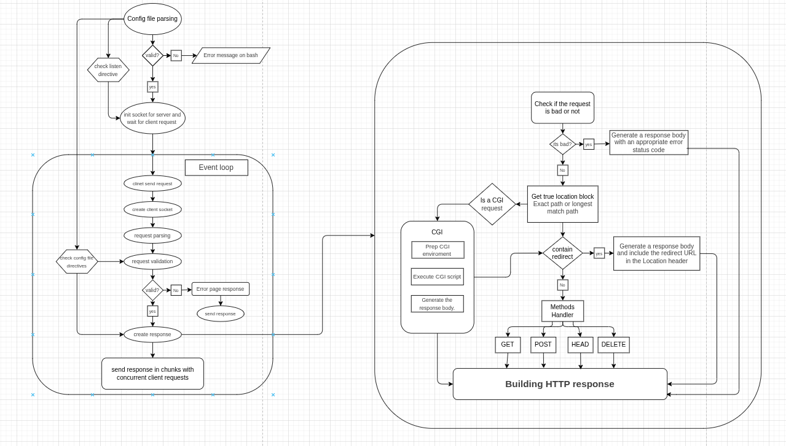

*This project has been created as part of the 42 curriculum by [maemra](https://github.com/maemran), [asaadeh](https://github.com/AhmadSaadeh03), [saabo-sh](https://github.com/sarahayman22).*

---

<div align="center">

# 🌐 WebServ


</div>

---

## 📖 Description

**WebServ** is a fully functional HTTP/1.1-compliant web server written in C++, inspired by and modeled after the behavior of **NGINX**. The goal of this project is to build a real-world web server from scratch — including socket programming, HTTP request/response handling, CGI execution, and multi-client concurrency — without relying on any external networking libraries.

### What is a Web Server?

A web server is a software system that accepts HTTP requests from clients (typically browsers) and returns HTTP responses. At its core, it listens on a network socket, parses incoming requests, and decides how to serve the appropriate content — whether that's a static file, a redirect, an error page, or a dynamically generated response via CGI.

### Key Concepts

- **HTTP/1.0 & HTTP/1.1 (RFC 1945 / RFC 2616):** The Hypertext Transfer Protocol defines how clients and servers communicate. Our server handles the essential methods: `GET`, `POST`, `HEAD`, and `DELETE`. Request parsing strictly follows the RFC specification, including headers, status codes, and chunked transfer encoding.

- **Sockets:** The server uses POSIX sockets (`socket()`, `bind()`, `listen()`, `accept()`) to establish TCP/IP connections. Multiple clients are handled concurrently using a non-blocking I/O model with `select()`/`poll()`, allowing the server to manage multiple connections in a single-threaded event loop without blocking.

- **NGINX Inspiration:** Like NGINX, our server reads a configuration file that specifies server blocks, listen directives, location rules, root directories, allowed methods, redirects, and error pages. The config parser validates all directives before the server starts accepting connections.

- **CGI (Common Gateway Interface):** The server supports CGI scripts (e.g., Python, PHP) for dynamic content generation. When a CGI request is detected, the server forks a child process, sets the appropriate environment variables, pipes the request body to the script's stdin, and reads the generated response from stdout.

- **Integration Flow:** All these components are tightly integrated. The config file defines how the socket layer is initialized. The event loop continuously monitors sockets for incoming data. Incoming data is parsed into HTTP requests, validated against config directives, routed to the correct handler (static file, CGI, redirect, error), and a properly formatted HTTP response is assembled and sent back to the client in chunks.

---

## 🚀 Instructions

### Prerequisites

- Linux or macOS
- `c++` with C++98 support
- `make`

### Installation & Execution

```bash
# 1. Clone the repository
git clone https://github.com/<your-org>/WebServer.git

# 2. Navigate into the project directory
cd WebServer

# 3. Compile the project
make

# 4. Run the server
# With a custom configuration file:
./webserv path/to/config.conf

# Or run with the default configuration file:
./webserv
```

Once running, the server will begin listening on the port(s) defined in the configuration file. You can test it by opening your browser at `http://localhost:<port>` or using `curl`.

---

## 📚 Resources

### Official Standards & References

| Resource | Description |
|---|---|
| [RFC 1945 – HTTP/1.0](https://datatracker.ietf.org/doc/html/rfc1945) | The original HTTP/1.0 specification defining request/response format, methods, and status codes |
| [RFC 2616 – HTTP/1.1](https://datatracker.ietf.org/doc/html/rfc2616) | Extended HTTP specification with persistent connections, chunked encoding, and more |
| [RFC 3875 – CGI/1.1](https://datatracker.ietf.org/doc/html/rfc3875) | The Common Gateway Interface specification, defining how servers communicate with external scripts |
| [NGINX Documentation](https://nginx.org/en/docs/) | Official NGINX docs; used as reference for config file structure and server/location block behavior |
| [Beej's Guide to Network Programming](https://beej.us/guide/bgnet/) | Comprehensive guide to POSIX socket programming in C/C++ |
| [MDN HTTP Documentation](https://developer.mozilla.org/en-US/docs/Web/HTTP) | Practical reference for HTTP headers, methods, and status codes |

### AI Usage

Artificial intelligence tools (Claude, ChatGPT) were used during this project for the following purposes:

- **RFC Clarification:** Some sections of RFC 1945 and RFC 3875 use dense technical language. AI was used to help interpret and clarify specific passages, particularly around request parsing rules, header semantics, and CGI environment variable requirements.
- **Code Optimization:** AI was consulted to review select C++ code snippets for potential improvements in memory management, string parsing efficiency, and non-blocking I/O patterns.
- **Debugging Assistance:** AI helped trace logic errors in edge cases (e.g., handling chunked request bodies, malformed headers, and concurrent client disconnections).

> All final implementation decisions were made by the project team. AI was used strictly as a learning and clarification tool, not to generate production code.

---

## 🗺️ Architecture & Flow

### Server Architecture Overview

Below is the architecture overview image of the project:




#
### Flow Explanation

**1. Config File Parsing**
On startup, the server reads and validates the configuration file. It checks for required directives such as `listen` (port/host), `server_name`, `root`, `location` blocks, allowed methods, error pages, and CGI extensions. If the config is invalid, an error is printed to stderr and the server exits.

**2. Socket Initialization**
Once config is validated, the server initializes one or more listening sockets bound to the ports defined in the config. The server then enters a blocking wait, ready to accept clients.

**3. Event Loop**
The heart of the server. A single-threaded loop uses `select()` or `poll()` to monitor all active file descriptors (listening sockets + client sockets) simultaneously. When activity is detected:
- A new connection → a client socket is created.
- Data on an existing socket → the raw HTTP request is read and parsed.

**4. Request Parsing & Validation**
The raw bytes are parsed into a structured HTTP request object (method, URI, headers, body). The request is then validated against the matching server/location block from the config. If invalid (malformed syntax, missing required headers, body too large, etc.), an appropriate error response (400, 413, etc.) is sent immediately.

**5. Routing & Response Generation**
Valid requests are routed based on the matched location block:
- **Bad request check:** Malformed or unsupported requests receive 4xx/5xx responses.
- **Location matching:** The server finds the most specific matching `location` block.
- **CGI check:** If the request targets a CGI-enabled path, the server forks a process, sets environment variables (`REQUEST_METHOD`, `CONTENT_TYPE`, `PATH_INFO`, etc.), and communicates via pipes.
- **Redirect check:** If the location contains a `return` directive, a 301/302 response is generated with the `Location` header.
- **Method Handler:** For normal requests, the appropriate handler is invoked (`GET` reads files, `POST` handles uploads/form data, `DELETE` removes files, `HEAD` returns headers only).

**6. HTTP Response Assembly**
All routes converge to the HTTP response builder, which assembles the status line, headers (Content-Type, Content-Length, Connection, etc.), and body into a standards-compliant HTTP response, then writes it back to the client socket in chunks.

---

<div align="center">

*Made with ❤️ at 42 by maemran, asaadeh & saabo-sh*

</div>